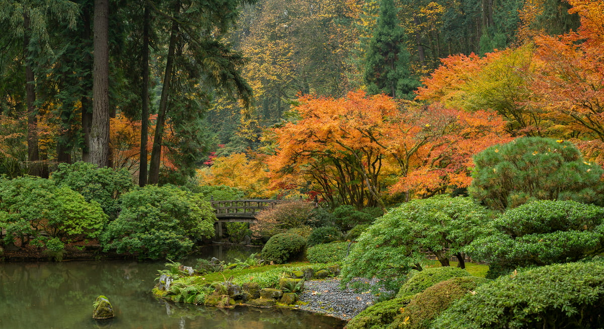
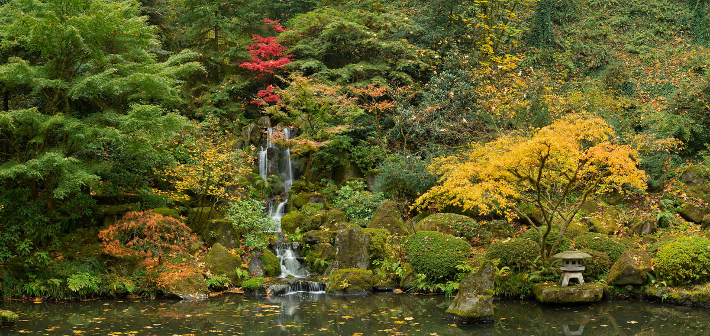
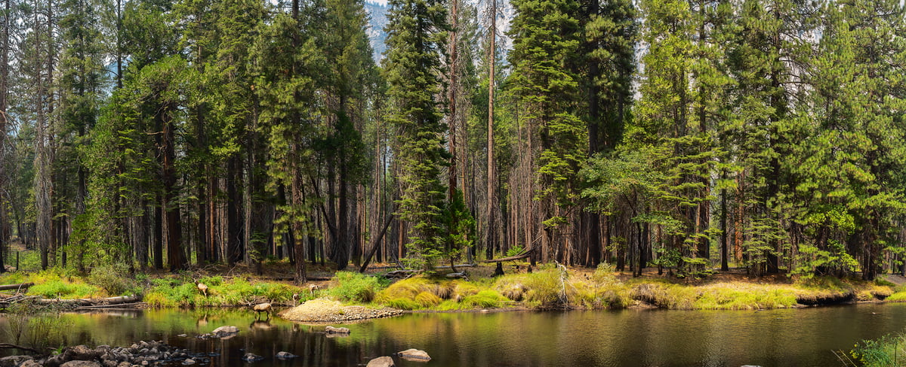
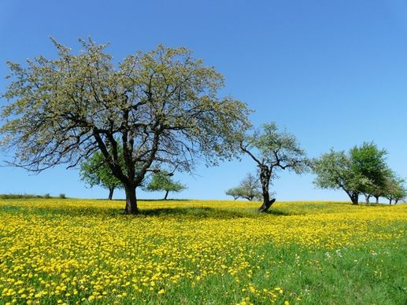
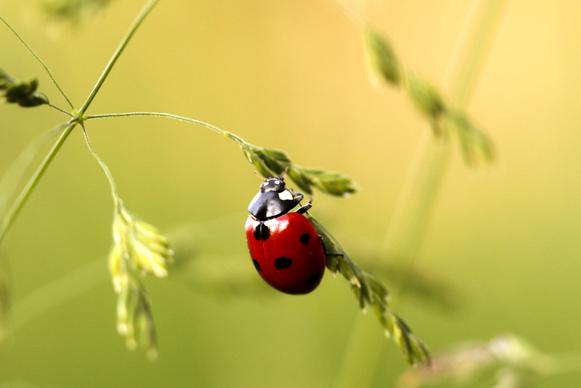

# Ex.07 Interactive Image Gallery
## Date:13/11/24

## AIM:
To design a interactive image gallery using html,css and javascript.

## DESIGN STEPS:

### Step 1:
Create a Django Admin project.

### Step 2:
Create an app in the Django interface.

### Step 3:
Create a folder named 'static' in the app folder.

### Step 4:
Create a new HTML file in the static folder.

### Step 5:
Write the HTML code with relevant CSS properties.

### Step 6:
Choose the appropriate style and color scheme.

### Step 7:
Insert the images in their appropriate places.

### Step 8:
Publish the website in the LocalHost.

## PROGRAM:
# index.html
```
<!DOCTYPE html>
<html lang="en">
<head>
    <meta charset="UTF-8">
    <meta name="viewport" content="width=device-width, initial-scale=1.0">
    <title>Accessible Photo Gallery</title>
    <link rel="stylesheet" href="mohan.css">
</head>
<body onload="addTabIndex()">
    <center>
    <h1>My Accessible Photo Gallery</h1>
</center>
    <div id="image" class="image-container" tabindex="0">
        Hover over an image below to display here.
    </div>
    <div class="gallery">
        <figure tabindex="0">
            
            <figcaption>Image 1</figcaption>
        </figure>
        <figure tabindex="0">
            
            <figcaption>Image 2</figcaption>
        </figure>
        <figure tabindex="0">
            
            <figcaption>Image 3</figcaption>
        </figure>
        <figure tabindex="0">
            
            <figcaption>Image 4</figcaption>
        </figure>
        <figure tabindex="0">
            
            <figcaption>Image 5</figcaption>
        </figure>
        <figure tabindex="0">
            
            <figcaption>Image 6</figcaption>
        </figure>
    </div>
    <script src="mohan.js"></script>
</body>
</html>

```
# script.js
```
function upDate(previewPic) {
    console.log("Mouse over:", previewPic.alt);
    document.getElementById("image").innerHTML = previewPic.alt;
    document.getElementById("image").style.backgroundImage = `url('${previewPic.src}')`;
}

function undo() {
    document.getElementById("image").innerHTML = "Hover over an image below to display here.";
    document.getElementById("image").style.backgroundImage = "url('')";
}

function addTabIndex() {
    const figures = document.querySelectorAll('.gallery figure');
    figures.forEach((figure, index) => {
        figure.setAttribute('tabindex', '0');
        console.log(`Tabindex added to figure ${index + 1}`);
    });
}

```
# styles.css
```
body {
    font-family: Arial, sans-serif;
}

.image-container {
    width: 400px;
    height: 400px;
    background-color: #f0f0f0;
    display: flex;
    align-items: center;
    justify-content: center;
    margin: 20px auto;
    border: 1px solid #ccc;
    text-align: center;
}

.gallery {
    display: flex;
    justify-content: center;
    flex-wrap: wrap;
}

.gallery figure {
    margin: 10px;
}

.gallery img {
    width: 100px;
    height: 100px;
    cursor: pointer;
    border: 2px solid transparent;
}

.gallery figure:focus img {
    border: 2px solid #007BFF; /* Highlight border on focus */
}

```

## OUTPUT:


## RESULT:
The program for designing interactive image gallery using html,css and javascript is completed successfully.
